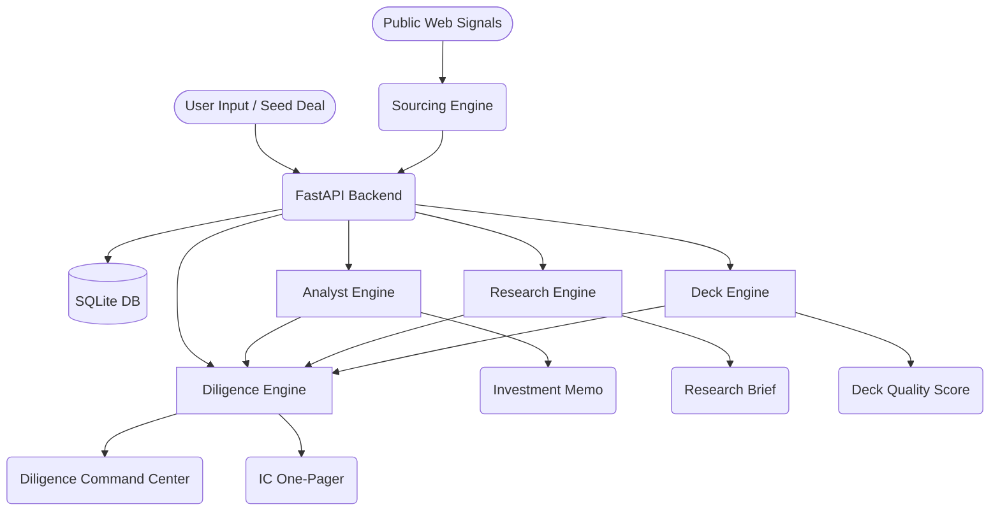
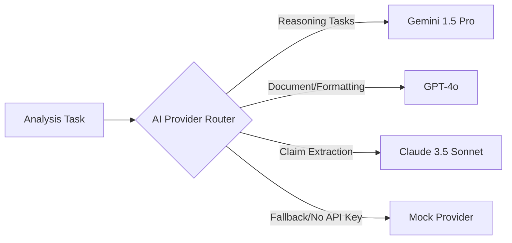

# Apex Capital Architecture

This document describes the decoupled, modular architecture of Apex Capital. 

## 1. Product Overview
Apex Capital is an Agentic VC Analyst Operating System. It simulates the workflow of a venture capital analyst by orchestrating AI to analyze unit economics, perform competitive research, score pitch decks, formulate a diligence plan, and synthesize an investment memo.

## 2. System Architecture
The application uses a strict separation of concerns to ensure that front-end state, back-end logic, and AI reasoning can be iterated independently.

- **Frontend**: Next.js 14 App Router (React 18) with Tailwind CSS.
- **Backend**: FastAPI with Python 3.9+.
- **Database**: SQLite (local) / PostgreSQL (production) with Alembic for migrations.
- **Security**: JWT-based Authentication, Workspace-level isolation (Multitenancy), Rate Limiting.
- **AI Router**: An abstraction layer that routes tasks to different Large Language Models (LLMs) with Tenacity retries.

## 2.1 The Sourcing Layer
Sitting "upstream" from the deal pipeline is the Sourcing Engine.
- **Thesis Engine**: Maintains state and parameters for active firm strategies.
- **Market Radar**: Uncovers anomalous signals and triggers discovery sweeps.
- **Sourcing Orchestrator**: Scores discovered companies and prepares them for pipeline ingestion.

## 3. Frontend Structure
The frontend prioritizes data density and component stability.
- `/app/deal/[id]/*`: Uses deep routing to manage the 7 states of a Deal Room: Overview, Scorecard, Research, Deck, Diligence, Memo, and IC.
- `lib/api.ts`: Centralizes all fetch calls with robust error handling and type-checking.

## 4. Backend Structure
The backend splits distinct analytical tasks into their own `Orchestrator` classes.
- `/sourcing_engine`: Manages proactive discovery, thesis matching, market tracking, and outreach generation.
- `/analysis_engine`: Manages deterministic unit economic scoring.
- `/research_engine`: Generates market sizing, competitor mapping, and grades evidence.
- `/deck_engine`: Parses unstructured pitch deck data and evaluates missing information.
- `/diligence_engine`: Synthesizes data from the other three engines to output a structured investigation plan.
- `/partner_copilot_engine`: Manages cross-fund chat and knowledge retrieval via learning loops.

## 5. Data Flow Diagram

## 6. AI Provider Router
Apex Capital is model-agnostic. The `AIProviderRouter` interface ensures that no code is hard-coupled to OpenAI, Google, or Anthropic. Tasks are intelligently routed to the most appropriate model based on capabilities (e.g. Gemini for reasoning, Claude for extraction).

All AI outputs are piped through a custom `json_parser.py` which strips Markdown, repairs malformed JSON, and enforces strict Pydantic schema validation. If the output fails validation, the system gracefully recovers.

## 7. Intelligent Fallback (Mock Mode)
To ensure **100% demo durability**, the system defaults to or falls back to `MockProvider` if:
- `ENABLE_REAL_LLM=False` is set in `.env`
- API keys are missing or invalid
- Provider APIs timeout or fail

The `MockProvider` intercepts requests and returns deterministic, high-quality, pre-written JSON responses. This guarantees flawless, predictable demos in interviews without requiring live API keys or suffering from latency. The UI (via the `/ai/status` endpoint) explicitly surfaces to the user which provider was ultimately used.

## 8. Future Production Enhancements
While the foundation is now production-ready (Auth, Workspaces, PostgreSQL compatibility), future enhancements could include:
1. Introduce a background worker queue (Celery/Redis) to handle long-running LLM research tasks (web scraping, PDF OCR).
2. Scale the Provider Router to support more granular task types and local models (e.g. Llama 3 via Ollama).
3. Connect live market data feeds (e.g. Pitchbook, Crunchbase API) for continuous verification.

## Agentic Workflow Architecture

The Agent Orchestrator runs after Web Research:
Deal -> Web Research Engine -> Agent Orchestrator -> Specialist Agents -> Evidence Graph -> Red Team Critique -> Decision Engine -> Autonomous Deal War Room -> Memo Writer -> IC One-Pager.

## Deal War Room Architecture

The **Autonomous Deal War Room** serves as the capstone of the evaluation process:
1. **Thesis & Anti-Thesis Construction**: Synthesizes structured arguments for and against the investment.
2. **Partner Persona Simulation**: Models IC debate by assigning LLMs distinct investor personas (e.g. Growth Partner, Deep Tech Partner).
3. **Fund Math Engine**: Computes required entry valuations, ownership scenarios, and fund returns dynamically based on cheque size and fund size parameters.
4. **Conviction Algorithm**: Translates qualitative evidence (market, product, traction) into a weighted 0-100 conviction score.
5. **Change Our Mind Protocol**: Generates strict conditions outlining what evidence would explicitly flip a 'Pass' to an 'Invest'.
